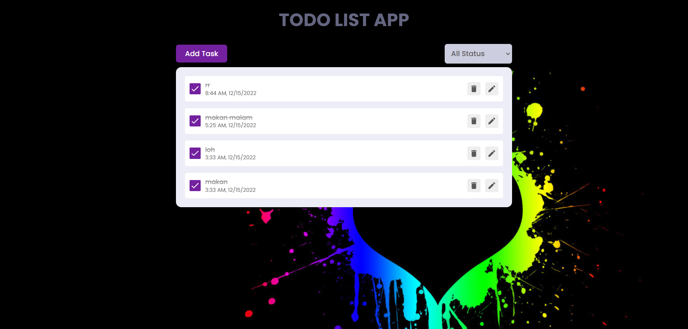
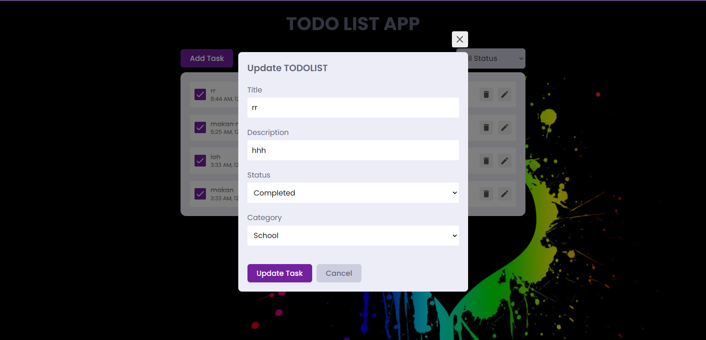

# React Todo App.

## Project Description
Project ini merupakan jawaban dari soal ke 4 test frontend baskit yang dibuat
dengan menggunakan react js

## What we Use

- [React](https://reactjs.org/)
- [React Redux](https://redux.js.org/)
- [Framer Motion](https://framer.com/motion/)
- [React icons](https://react-icons.netlify.com/)
- [React Hot Toast](https://react-hot-toast.com/)

## Requirements

- Basic ReactJs
- Basic HTML, CSS

## Getting Started

clone this repository and you need to go the file directory and run

```shell
npm install
```

and after that start the dev server.

```shell
npm start
```
